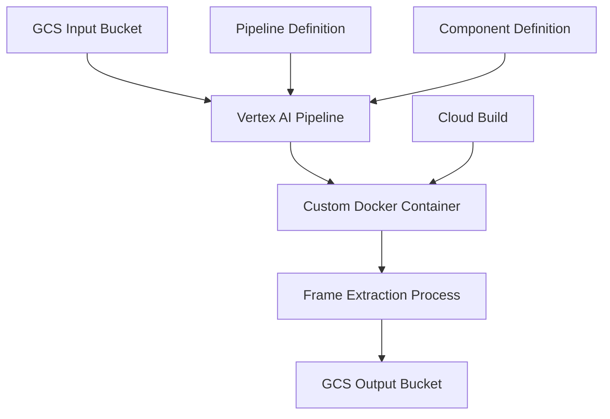

# Understanding Vertex AI Pipelines: A Complete Guide
## Introduction to Video Frame Extraction Pipeline

This guide explains how to build and run a Vertex AI pipeline that extracts frames from videos stored in Google Cloud Storage (GCS). We'll break down each component and explain how they work together.

## System Architecture Overview



## Part 1: Components Overview

### 1.1 Key Components
1. **Docker Container**: Runs the actual video processing
2. **Pipeline Definition**: Describes how the process should run
3. **Component Definition**: Specifies the interface between pipeline and container
4. **Submission Script**: Triggers and monitors the pipeline
5. **GCS Buckets**: Store input videos and output frames

### 1.2 Required Files
- `Dockerfile`: Defines the container environment
- `eh_image_extractor.py`: Core video processing logic
- `pipeline.py`: Pipeline structure definition
- `component.yaml`: Component interface specification
- `submit_pipeline.py`: Pipeline execution script

## Part 2: Step-by-Step Process

### 2.1 Container Setup (One-time setup)
1. Build Docker image with required dependencies:
   - OpenCV for video processing
   - Google Cloud Storage client
   - Other Python dependencies

2. Push to Google Artifact Registry:
```bash
# Build and push using Cloud Build using Cloud Build trigger.
gcloud builds triggers run mentorship-cloudbuild-trigger --region=us-central1 --project=eh-ml-mentorship
```

### 2.2 Pipeline Definition
1. Define component (component.yaml):
```yaml
name: Video Frame Extractor
inputs:
- name: input_source
  type: String
- name: output_path
  type: String
- name: frame_rate
  type: Integer
implementation:
  container:
    image: [CONTAINER_IMAGE]
    command: [...]
    args: [...]
```

2. Create pipeline (pipeline.py):
```python
@dsl.pipeline(
    name='video-frame-extraction-pipeline',
    description='Extracts frames from videos'
)
def pipeline(input_source: str, output_path: str, frame_rate: int):
    video_frame_extractor_task = video_frame_extractor_op(
        input_source=input_source,
        output_path=output_path,
        frame_rate=frame_rate
    )
```

### 2.3 Execution Process

1. **Pipeline Compilation**:
   - Convert pipeline definition to JSON format
   - Define execution parameters
   - Specify resource requirements

2. **Pipeline Submission**:
   - Initialize Vertex AI client
   - Set pipeline parameters
   - Submit job for execution

3. **Execution Flow**:
   a. Pipeline starts in Vertex AI
   b. Creates container instance
   c. Mounts necessary storage
   d. Executes video processing
   e. Stores results in output location

## Part 3: Code Walkthrough

### 3.1 Video Processing Logic
```python
def extract_frames(video_file, output_dir, frame_rate):
    # Initialize video capture
    cap = cv2.VideoCapture(video_file)
    
    # Calculate frame interval
    fps = cap.get(cv2.CAP_PROP_FPS)
    interval = int(round(fps / frame_rate))
    
    # Process frames
    while success:
        if frame_count % interval == 0:
            save_frame(image)
        success, image = cap.read()
```

### 3.2 Pipeline Submission
```python
def submit_pipeline():
    # Initialize Vertex AI
    aiplatform.init(project=PROJECT_ID, location=REGION)
    
    # Create pipeline job
    pipeline_job = aiplatform.PipelineJob(
        template_path='pipeline.json',
        parameter_values={
            'input_source': GCS_INPUT,
            'output_path': GCS_OUTPUT,
            'frame_rate': FRAME_RATE
        }
    )
    
    # Execute pipeline
    pipeline_job.run()
```

## Part 4: Best Practices and Tips

### 4.1 Error Handling
- Implement robust error checking
- Add logging at key points
- Include cleanup procedures
- Handle GCS permissions properly

### 4.2 Resource Management
- Monitor memory usage
- Implement cleanup of temporary files
- Use appropriate machine types
- Consider cost optimization

### 4.3 Testing
- Test locally first
- Verify GCS permissions
- Start with small video files
- Monitor pipeline execution

## Part 5: Common Issues and Solutions

### 5.1 Permission Issues
- Verify service account roles
- Check bucket permissions
- Ensure container has proper credentials

### 5.2 Resource Issues
- Monitor memory usage
- Check disk space
- Verify network access

### 5.3 Pipeline Issues
- Validate input parameters
- Check pipeline status
- Review execution logs

## Part 6: Monitoring and Maintenance

### 6.1 Pipeline Monitoring
- Use Cloud Logging
- Monitor resource usage
- Track success/failure rates

### 6.2 Cost Management
- Monitor GCS usage
- Optimize frame extraction rate
- Clean up temporary resources

## Conclusion

This pipeline demonstrates key concepts in Vertex AI:
1. Custom component creation
2. Pipeline orchestration
3. Cloud resource management
4. Scalable processing

Understanding these concepts helps in building other ML pipelines and data processing workflows on GCP.